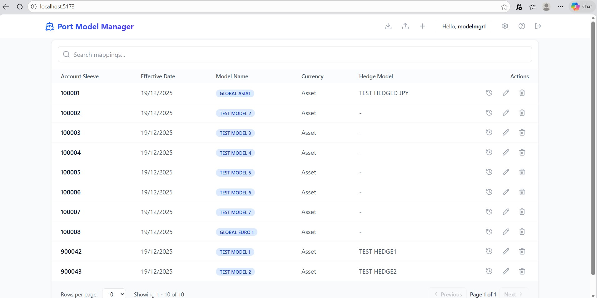
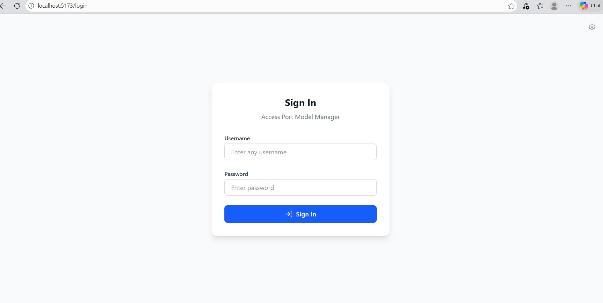
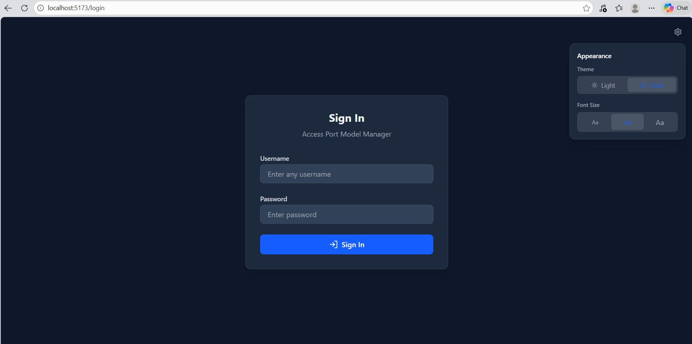
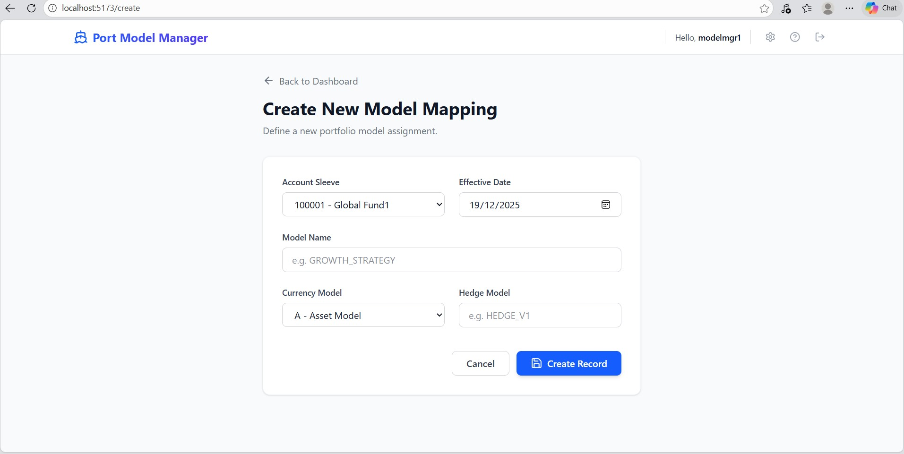
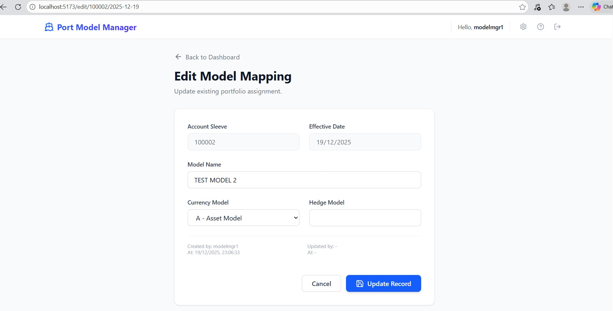
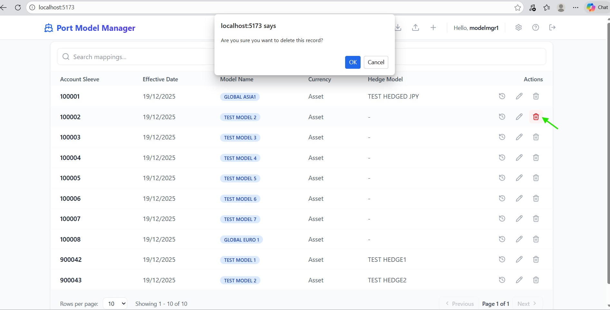
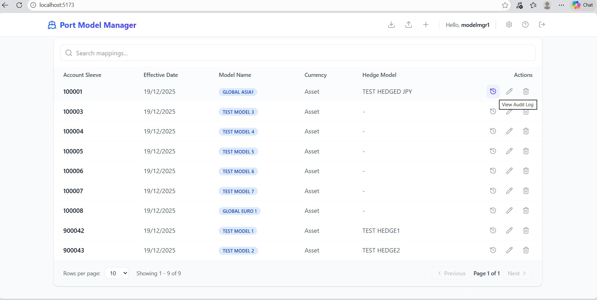
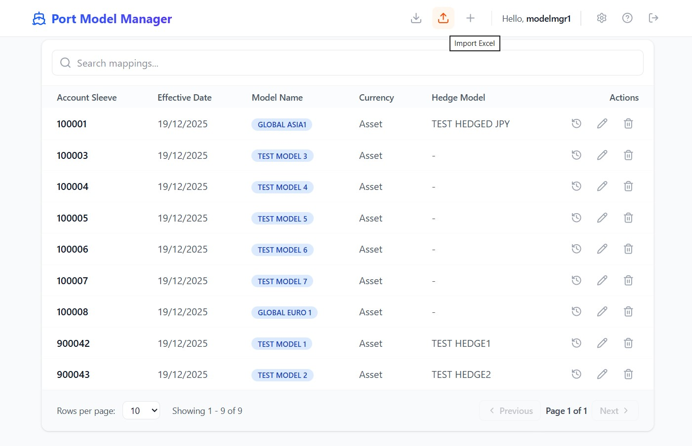
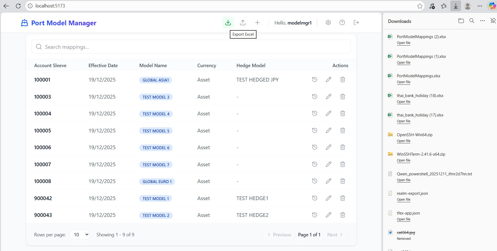

# Portfolio Model Management System

A comprehensive fund management application for managing portfolio security models and currency hedging models with self-service capabilities for fund managers.

## Table of Contents
- [Overview](#overview)
- [Project Structure](#project-structure)
- [System Architecture](#system-architecture)
- [Features](#features)
- [Technology Stack](#technology-stack)
- [Getting Started](#getting-started)
- [Running the Application](#running-the-application)
- [Screenshots](#screenshots)
- [User Guide for Fund Managers](#user-guide-for-fund-managers)
- [Configuration](#configuration)

---

## Overview

The Portfolio Model Management System enables fund managers to independently manage:
- **Portfolio Security Models** - Define and manage security allocations within portfolios
- **Portfolio Currency Hedging Models** - Configure currency hedging strategies and allocations
- **Audit Trail** - Full history of all model changes with timestamps and user tracking

### Key Benefits
✅ Self-service model management - no IT dependency  
✅ Real-time audit trail for compliance  
✅ Multi-tenant portfolio support  
✅ Secure authentication via Keycloak  
✅ Full CRUD operations (Create, Read, Update, Delete)  

---

## Project Structure

```
model_crud/
├── backend/                          # .NET 8 API Server
│   ├── PortModelApi/
│   │   ├── Controllers/
│   │   │   ├── AuthController.cs          # Authentication & Login
│   │   │   ├── PortfoliosController.cs    # Portfolio Lookups
│   │   │   ├── PortModelMappingsController.cs   # Model CRUD & Excel Logic
│   │   │   └── PortModelMappingAuditsController.cs  # Audit Trail
│   │   ├── Data/
│   │   │   └── AppDbContext.cs            # EF Core Data Context
│   │   ├── Models/
│   │   │   ├── Portfolio.cs               # Portfolio Entity
│   │   │   ├── PortModelMapping.cs        # Main Model Entity
│   │   │   ├── PortModelMappingAudit.cs   # Audit Log Entity
│   │   │   └── LoginRequest.cs            # Auth DTO
│   │   ├── Services/
│   │   │   ├── ColumnLengthProvider.cs    # Metadata/Validation Service
│   │   │   └── DatabaseInitializer.cs     # Auto-Schema Migration Service
│   │   ├── Program.cs                     # App Entry & Middleware
│   │   ├── appsettings.json               # Configuration
│   │   └── PortModelApi.csproj            # Project File
│   ├── backend.sln                        # Backend Solution
│   └── table.sql                          # Database Schema (Reference)
│
├── frontend/                         # SvelteKit Web Application
│   ├── src/
│   │   ├── lib/
│   │   │   ├── api.ts                     # API Client
│   │   │   ├── auth.ts                    # Auth Management
│   │   │   ├── settings.svelte.ts         # Dark Mode & Font Size State
│   │   │   └── components/                # UI Components
│   │   ├── routes/
│   │   │   ├── +layout.svelte             # Main Shell & Theme Wrapper
│   │   │   ├── +page.svelte               # Dashboard & Model List
│   │   │   ├── login/                     # Login Page
│   │   │   ├── create/                    # Model Creation
│   │   │   ├── edit/                      # Model Editing
│   │   │   └── help/                      # Documentation & Help
│   ├── tailwind.config.js                 # Styling Configuration
│   ├── package.json                       # Dependencies
│   └── vite.config.ts                     # Build Pipeline
│
├── compose.yaml                      # Docker Orchestration
├── compose.bat                        # Windows Start Script
└── keycloak.bat                       # Identity Provider Setup
```

---

## System Architecture

```
┌─────────────────────────────────────────────────────────────┐
│                    Fund Manager Browser                      │
└────────────────────────────┬────────────────────────────────┘
                             │
                             │ HTTPS
                             │
         ┌───────────────────▼────────────────────┐
         │      SvelteKit Frontend (Port 5173)    │
         │  ├─ Login Page (OAuth 2.0)             │
         │  ├─ Dashboard (Model List)             │
         │  ├─ Create/Edit Model Forms            │
         │  └─ Audit Trail Viewer                 │
         └───────────────────┬────────────────────┘
                             │
                             │ HTTP/CORS
                             │
         ┌───────────────────▼──────────────────────────┐
         │    .NET 8 API Server (Port 5137)             │
         │  ├─ JWT Token Validation                     │
         │  ├─ Portfolio Service (Read-only)            │
         │  ├─ Model Mapping Service (CRUD)             │
         │  ├─ Audit Service (Logging)                  │
         │  └─ CORS Policy (5173)                       │
         └───────────────────┬──────────────────────────┘
                             │
                             │ SQL Server Protocol
                             │
         ┌───────────────────▼──────────────────────────┐
         │      SQL Server Database                     │
         │  ├─ Portfolios Table                         │
         │  ├─ PortModelMappings Table                  │
         │  └─ PortModelMappingAudits Table             │
         └──────────────────────────────────────────────┘

         ┌──────────────────────────────────────────────┐
         │      Keycloak (Port 8080)                    │
         │  ├─ User Authentication                      │
         │  ├─ JWT Token Generation                     │
         │  └─ Authorization                            │
         └──────────────────────────────────────────────┘
```

---

## Features

### 1. **Portfolio Model Management**
- **Create**: Define new security models for a portfolio with:
  - Portfolio Account Number
  - Model effective date
  - Security Model or Hedging Model
  - Model Name
  - Hedging Model Name
  
- **Read**: View all assigned models with filters:
  - Search by portfolio account
  - Filter by date range
  - View model details and status
  
- **Update**: Modify existing models:
  - Adjust security allocations
  - Update model parameters
  - Change effective dates
  
- **Delete**: Remove outdated or incorrect models:
  - Soft delete with audit trail
  - Historical tracking

### 2. **Excel Integration & Portability**
- **Bulk Import**: Quickly upload model definitions from Excel templates.
- **Data Export**: Export current model listings and audit trails directly to `.xlsx` format for reporting or offline analysis.
- **Template-Based**: Ensures data consistency through standardized Excel structures.

### 3. **Aesthetics & Accessibility**
- **Dark Mode**: Fully supports native dark mode for reduced eye strain.
- **Dynamic Font Sizing**: User-adjustable font sizes for better readability across different displays.
- **Premium UI**: Modern, glassmorphism-inspired design with smooth transitions.

### 4. **Audit Trail & Compliance**
- **Automatic logging** of all changes:
  - Who made the change (User ID)
  - When it was made (Timestamp)
  - What was changed (Old vs. New values)
  - Action type (Create/Update/Delete)
  
- **Compliance ready**:
  - 100% audit coverage
  - Immutable historical records
  - Regulatory reporting support

### 5. **Security & Authentication**
- **Keycloak Integration** (OAuth 2.0 / OpenID Connect):
  - Centralized user management
  - Role-based access control (RBAC)
  - Multi-factor authentication support (if configured)
  - Session management
  
- **JWT Tokens**:
  - Stateless API authentication
  - Token-based authorization on all endpoints
  - Automatic token refresh

### 6. **User-Friendly Interface**
- Dashboard with model overview
- Inline create/edit forms
- Responsive design (mobile-friendly)
- Real-time validation
- Confirmation dialogs for destructive operations

---

## Screenshots

### Dashboard & Overview


### Authentication



### Model Management (CRUD)




### Audit Trail


### Data Operations



---

## Technology Stack

### Backend
| Component | Technology | Version |
|-----------|-----------|---------|
| Runtime | .NET | 8.0 |
| Framework | ASP.NET Core | 8.0 |
| ORM | Entity Framework Core | Latest |
| Database | SQL Server | 2019+ |
| Authentication | JWT + Keycloak | OAuth 2.0 |
| API Documentation | Swagger/OpenAPI | 3.0 |
| Testing | xUnit | Latest |

### Frontend
| Component | Technology | Version |
|-----------|-----------|---------|
| Framework | SvelteKit | Latest |
| Language | TypeScript | 5.0+ |
| Styling | Tailwind CSS | 3.0+ |
| Build Tool | Vite | 5.0+ |
| HTTP Client | Fetch API | Native |
| State Management | Svelte Stores | Built-in |

### Infrastructure
| Component | Technology |
|-----------|-----------|
| Containerization | Docker |
| Orchestration | Docker Compose |
| Authentication Server | Keycloak |
| Web Server | Kestrel + Nginx (Prod) |

---

## Getting Started

### Prerequisites
- **Backend**: .NET 8 SDK, SQL Server 2019+
- **Frontend**: Node.js 18+, npm 9+
- **Infrastructure**: Docker & Docker Compose (for containerized setup)
- **Authentication**: Keycloak instance (local or remote)

### Installation

#### 1. Clone/Setup Repository
```bash
cd d:\projects\model_crud
```

#### 2. Database Setup

The backend API is equipped with a **Database Initializer** that automatically sets up the environment on startup. It will:
- Verify the connection to SQL Server.
- Create the `crd` schema if it doesn't exist.
- Create all required tables (`port_model_mapping`, `port_model_mapping_audit`).
- Create necessary indices for performance.
- Automatically migrate/add columns if the schema is updated.

**Manual Setup (Optional Reference):**
If you prefer to see the schema or run it manually:
```bash
# Execute SQL schema manually
sqlcmd -S <YourServer> -d <YourDatabase> -i backend/table.sql
```

> [!NOTE]
> Ensure your connection string in `backend/PortModelApi/appsettings.Development.json` is correct before running the backend.

#### 3. Configure Backend (appsettings files already configured)
- Database connection in `backend/PortModelApi/appsettings.Development.json`
- Keycloak authority in configuration
- CORS origins (already set to `http://localhost:5173`)

#### 4. Install Frontend Dependencies
```bash
cd frontend
npm install
```

---

## Running the Application

### **Option 1: Local Development (Recommended)**

#### Terminal 1 - Backend API
```bash
cd backend
dotnet run --project PortModelApi
# API runs on http://localhost:5137
```

#### Terminal 2 - Frontend Dev Server
```bash
cd frontend
npm run dev
# App runs on http://localhost:5173
```

#### Terminal 3 - Keycloak (if not running)
```bash
./keycloak.bat
# or docker run as per setup
```

**Access the app**: http://localhost:5173  
**API Docs**: http://localhost:5137/swagger

---

### **Option 2: Docker Compose (Production-like)**

```bash
# Build and start all services
docker-compose up --build

# Services:
# - Frontend: http://localhost:3000 (or configured port)
# - Backend API: http://localhost:5137/api
# - Keycloak: http://localhost:8080
```

#### Using Helper Scripts (Windows)
```batch
# Start all services
compose.bat

# Setup Keycloak realm
keycloak.bat
```

---

## User Guide for Fund Managers

### **Login**
1. Open http://localhost:5173
2. Click "Login" button
3. Enter Keycloak credentials
4. You'll be redirected to the dashboard

### **Dashboard - View Models**
- Lists all portfolio models you have access to
- Shows Account Number, Date, and Status
- Click model row to view details
- Use search/filter to find specific models

### **Creating a New Model**

#### Step 1: Navigate to Create
1. Click **"Create New Model"** button
2. Select portfolio account number from dropdown
3. Choose effective date

#### Step 2: Define Security Model
- Add security holdings with:
  - **Security Code**: Identifier (e.g., AAPL)
  - **Allocation %**: Weight in model (e.g., 15.5%)
  - **Description**: Optional notes

#### Step 3: Define Currency Hedging (if applicable)
- Currency pairs to hedge (e.g., EUR/USD)
- Hedge ratios and coverage levels

#### Step 4: Review & Submit
- Review all entries
- Click **"Save Model"**
- You'll see confirmation with model ID

### **Updating an Existing Model**

1. Click **"Edit"** on the model row
2. Modify any values:
   - Change allocations
   - Add/remove securities
   - Update hedging parameters
3. Click **"Save Changes"**
4. System creates new audit entry (no data loss)

### **Deleting a Model**

1. Click **"Delete"** on the model row
2. Confirm deletion (warning appears)
3. Model marked as deleted
4. Previous versions retained in audit trail

### **Viewing Audit History**

1. Click **"View History"** on model row
2. See all changes made to this model:
   - Date & time of change
   - User who made change
   - What was changed (before/after)
   - Action type (Create/Update/Delete)

### **Common Scenarios**

**Scenario 1: Rebalancing Portfolio for New Quarter**
1. Go to Dashboard
2. Find current model
3. Click "Edit"
4. Update allocations based on market analysis
5. Save - system logs all changes
6. Previous model stays in history

**Scenario 2: Hedging Currency Risk**
1. Create new model or edit existing
2. Add currency hedging section
3. Set hedge ratios per currency pair
4. Save for auditors to review

**Scenario 3: Audit Request - Prove Model Changes**
1. Click "View History" on any model
2. See complete change log
3. Export/print for compliance
4. Shows exactly who changed what and when

---

## Configuration

### Frontend Configuration

#### Development (.env.development)
```env
VITE_API_URL=http://localhost:5137/api
```

#### Production (.env.production)
```env
VITE_API_URL=https://api.yourdomain.com
```

### Backend Configuration

#### Development (appsettings.Development.json)
```json
{
  "ConnectionStrings": {
    "DefaultConnection": "Server=TOMNB;Database=model_crud_db;..."
  },
  "Keycloak": {
    "Authority": "http://localhost:8080/realms/model_crud",
    "ClientId": "backend-api"
  },
  "Cors": {
    "AllowedOrigins": "http://localhost:5173"
  }
}
```

#### Production (appsettings.json)
- Update connection string to production database
- Change Keycloak authority to production realm
- Update CORS origins to production domain
- Enable HTTPS redirection

### Environment Variables (Docker)
```bash
# Database
DB_SERVER=db_server
DB_NAME=model_crud_db
DB_USER=dbuser1

# Keycloak
KEYCLOAK_AUTHORITY=http://keycloak:8080/realms/model_crud
KEYCLOAK_CLIENT_ID=backend-api

# API
API_PORT=5137
API_URL=http://api:5137
```

---

## API Endpoints

### Authentication
- `POST /api/Auth/login` - Login (returns JWT token)

### Portfolios (Read-only)
- `GET /api/Portfolios` - List all portfolios
- `GET /api/Portfolios/{code}` - Get portfolio details

### Portfolio Model Mappings (CRUD)
- `GET /api/PortModelMappings` - List all models
- `GET /api/PortModelMappings/{accno}/{date}` - Get specific model
- `POST /api/PortModelMappings` - Create new model
- `PUT /api/PortModelMappings/{accno}/{date}` - Update model
- `DELETE /api/PortModelMappings/{accno}/{date}` - Delete model

### Audit Trail
- `GET /api/PortModelMappingAudits/{accno}/{date}` - Get change history

---

## Troubleshooting

| Issue | Solution |
|-------|----------|
| **Cannot login** | Check Keycloak is running; verify credentials in realm |
| **API connection fails** | Ensure backend is running on 5137; check .env.development |
| **CORS errors** | Verify frontend origin in backend CORS config |
| **Database errors** | Run `table.sql` script; check connection string |
| **Docker port conflicts** | Change ports in `compose.yaml` if 5173/5137/8080 in use |

---

## Support & Documentation

- **Backend API Docs**: http://localhost:5137/swagger (Swagger UI)
- **Keycloak Admin**: http://localhost:8080/admin
- **Source Code**: See project structure above

---

**Version**: 1.0  
**Last Updated**: December 2025
